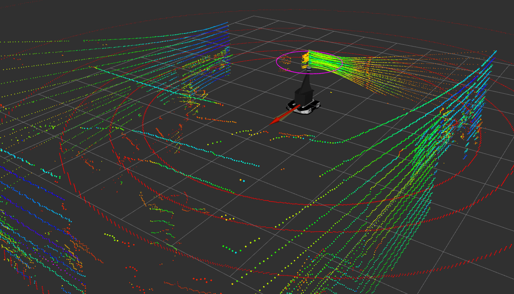

# Akula ignition simulation with LIDAR (VLP-16)
Akula (Shark) robot is based on Tracer differential drive robot. 

This package is created and tested only with `ros2-foxy` version!



### Setup
* Install ros2-foxy: https://docs.ros.org/en/foxy/Installation.html
* Install ignition fortress: https://gazebosim.org/docs/fortress/install_ubuntu
* Install ign-ros2-control: 
    `apt install ros-$ROS_DISTRO-ign-ros2-control`
* Install ros-ign-gazebo: 
    `sudo apt install ros-$ROS_DISTRO-ros-ign-gazebo`
* Install ros-ign-bridge: 
    `sudo apt install ros-$ROS_DISTRO-ros-ign-bridge`

### Install package
```
mkdir -p tracer_ws/src
cd tracer_ws/src
git clone https://github.com/NDHANA94/akula_diff_drive_robot.git    
git clone --branch foxy https://github.com/ros-controls/gz_ros2_control.git ign_ros2_control
rosdep install -r --from-paths . --ignore-src --rosdistro $ROS_DISTRO -y
cd ..
export IGNITION_VERSION=fortress
colcon build
```

### launch ignition gazebo simulation with rviz2
```
source install/setup.bash
ros2 launch akula_ign_sim akula_ros2.launch.py
```

### controlling Akula robot via teleop_twist_keyboard
```
ros2 run teleop_twist_keyboard teleop_twist_keyboard --ros-args -r /cmd_vel:=/tracer_controller/cmd_vel_unstamped
```

